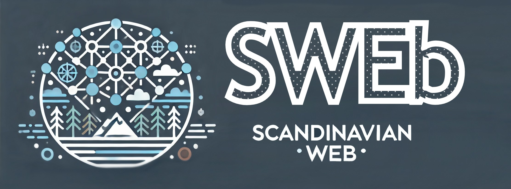
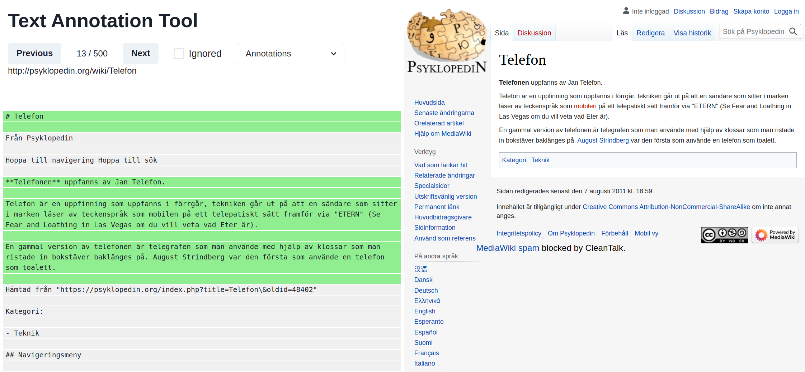
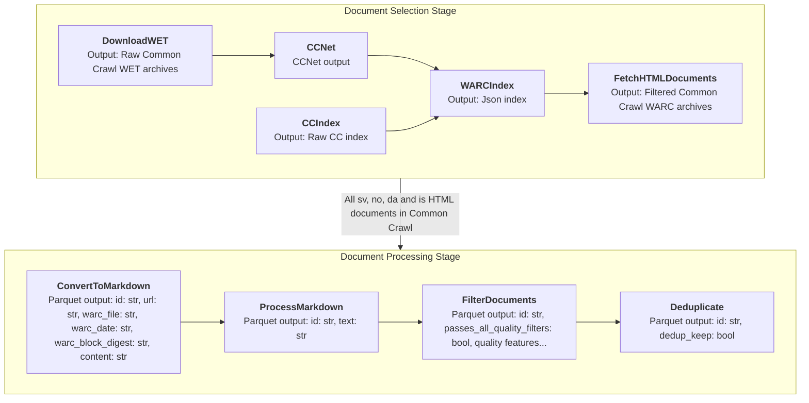

This is the official source code repository for the [Scandinavian Web (SWEb) dataset](https://huggingface.co/datasets/AI-Sweden-Models/SWEb) and corresponding [paper](#link).

SWEb is a _trillion token scale_ pre-training dataset for the Swedish, Danish, Norwegian and Icelandic languages. We construct SWEb using a novel pipeline and source data from 98 Common Crawl dumps. 

Our pipeline is built around a novel model based extractor to extract text from webpages. In essence, the pipeline consists of the following steps:

1. Start from a raw HTML page
2. Convert it to Github Markdown (using pandoc)
3. Extract the primary content using [our trained model](https://huggingface.co/AI-Sweden-Models/SWEb-markdown-extractor)
4. Filter and deduplicate

Let's look at an [example](https://www.ai.se/sv/nyheter/nobelpriset-i-fysik-och-kemi-till-banbrytande-ai-forskning) to understand how it works:

```python
import os
import requests
from torch.nn.functional import sigmoid
from pipeline.warc_processing import ConvertToMarkdown
from transformers import AutoTokenizer, AutoModelForTokenClassification

# 1. Download a webpage
resp = requests.get("https://www.ai.se/sv/nyheter/nobelpriset-i-fysik-och-kemi-till-banbrytande-ai-forskning")

# 2. Convert HTML to markdown using pandoc
markdown = ConvertToMarkdown.convert_html_to_markdown(resp.content, pandoc_path=f"{os.environ['HOME']}/bin/pandoc")  # path to pandoc 2.9.2.1, see INSTALL.md

# 3. Extract text by classifying each line using trained model
tokenizer = AutoTokenizer.from_pretrained("AI-Sweden-Models/SWEb-markdown-extractor")
model = AutoModelForTokenClassification.from_pretrained("AI-Sweden-Models/SWEb-markdown-extractor").eval()
tokens = tokenizer(markdown.replace("\n", tokenizer.sep_token), return_tensors="pt", add_special_tokens=False, truncation=True)
tokens["line_sep_token_ids"] = (tokens.input_ids[0] == tokenizer.sep_token_id).nonzero()[None, :, 0]
logits = model(**tokens)[0]
extracted_lines = [
  line for line, pred in zip(markdown.split("\n"), sigmoid(logits))
  if pred > 0.05
]

# Print extracted text
print("\n".join(extracted_lines))
```

outputs:

```markdown
# Nobelpriset i fysik och kemi till banbrytande AI-forskning

tisdag, oktober 8, 2024

Två Nobelpris till AI 2024\! Det i fysik går till forskning som lagt grunden till maskininlärning och artificiell intelligens, och det i kemi till Google DeepMinds AlphaFold2

*– Det är fantastiskt att det här viktiga arbetet får ett sådant erkännande. Särskilt den tillämpade AI som uppmärksammas i Kemipriset*, säger Johanna Bergman, Director of Strategic Initiatives på AI Sweden.

...
```

## Model based Text Extraction

At the center of the SWEb pipeline sits our **custom extractor**, a model trained to extract the primary content of web pages. 
This is in contrast to rule-based extractors such as trafilatura.
With a model-based approach, we have greater control over the extraction process and can improve and adapt it by annotating data until we reach a desired performance.

The model works by classifying each _line_ of the markdown document into `keep` or `remove` labels.
We feed the full document into a Longformer model, replacing each newline  with a special [SEP] token. 
We then predict the keep/remove label on each such token.
This allows the model to take a larger document context into account when predicting the labels.

To train this model, we build a custom [annotation tool](annotation_tool/) that allowed us to quickly label a dataset of primary content for a set of webpages:



We release openly our annotated [data](annotation_tool/backend/data/data.jsonl), the [training code](pipeline/line_classification/train.py) and the resulting [model](https://huggingface.co/AI-Sweden-Models/SWEb-markdown-extractor).


## Pipeline

We use [luigi](https://github.com/spotify/luigi) to build a data processing pipeline to run this at scale.
SWEb is the result of running the pipeline over 98 Common Crawl dumps, all available up until 2024-26.

This flowchart describes what the pipeline looks like, with each box representing a luigi `Task`:



In the Document Selection stage, the `CCNet` task runs CC Net which uses the WET archives of Common Crawl, and all Scandinavian documents are selected. We then want to download the corresponding WARC records for these documents (e.g. raw HTML). Since the WARC archives of CC are very large, we rely on byte range requests to selectively download only the documents we're interested in. To do this, we first build an index to know, for each *.warc.gz file, which byte ranges to download. Then, in the FetchHTMLDocuments task, we download all the documents.

In the Document Processing stage, each task produces a parquet dataset (of 1000 shards) with the index shared over all datasets. As parquet is column based, this allows us to effectively add new columns at each task.

In the `ConvertToMarkdown` task, the WARC files constructed in the Document Selection stage are consumed and each document is converted to markdown using pandoc. In the `ProcessMarkdown` task, we run our model to extract the main content from each document.
In the `FilterDocuments` task we compute our quality metrics and add a binary column `passes_all_quality_filters` that indicates the binary filtering decision for each document. Similarly, the `Deduplicate` task adds a `dedup_keep` column indicating deduplication.

### How to run

Begin by preparing the environment and [install](INSTALL.md) all the required dependencies.

**Note 1**: The pipeline has been developed to be run on a Slurm cluster, so most of the tasks rely on submitting jobs via the `sbatch` command.

**Note 2**: Please find pipeline configuration in [luigi.cfg](luigi.cfg), you'll need to adjust paths and parameters for your environment. Depending on your cluster spec, you'll likely also need to create/adapt a `*_CONFIG` in [cc_net_repo/cc_net/mine.py](cc_net_repo/cc_net/mine.py) (used in CCNet task).

With the environment in place, any task and its dependencies can be run with the luigi launcher. Here are some examples:

```bash
# To run e.g. DownloadWET for the 2024-10 dump
python -m luigi --module pipeline.cc_net DownloadWET --dump 2024-10

# To run e.g. FetchHTMLDocuments (incl. any missing dependent tasks) for the 2024-10 dump
python -m luigi --module pipeline.warc_processing FetchHTMLDocuments --dump 2024-10

# To run the full pipeline, i.e the final deduplicate task, for all dumps, run:
python -m luigi --module pipeline.dedup DeduplicateIndividually --dumps all
```

You can optionally run multiple tasks in parallel using the `--workers 2` flag.


## Citation

To cite this work, please use the following:

```
@misc{norlund2024sweblargewebdataset,
      title={SWEb: A Large Web Dataset for the Scandinavian Languages}, 
      author={Tobias Norlund and Tim Isbister and Amaru Cuba Gyllensten and Paul Dos Santos and Danila Petrelli and Ariel Ekgren and Magnus Sahlgren},
      year={2024},
      eprint={2410.04456},
      archivePrefix={arXiv},
      primaryClass={cs.CL},
      url={https://arxiv.org/abs/2410.04456}, 
}
```